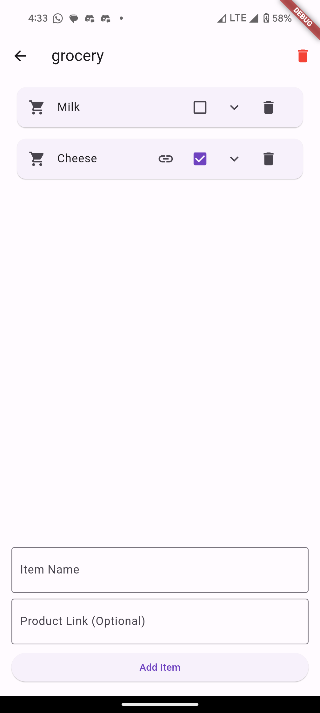
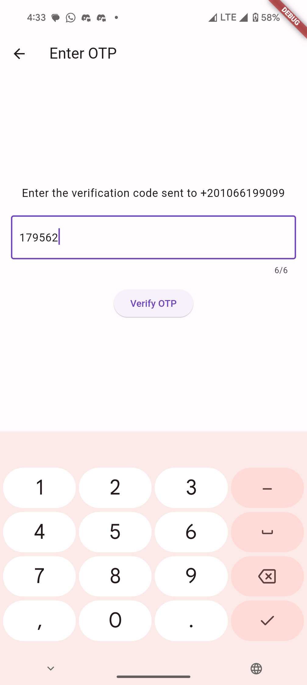
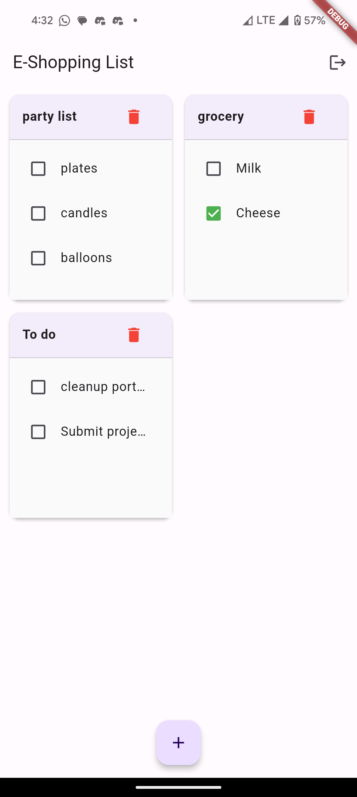

# e_shopping_list
This an app to manage shopping lists with the ability to add links for reference

## Authors
- Doha Ehab [www.linkedin.com/in/doha-ahmed-75321735a] 
- [App Link] (https://appdistribution.firebase.google.com/testerapps/1:985202200278:android:6ee3e75bccf42ac4280377/releases/2prskdsg2hg1g?utm_source=firebase-console)
- [Demo] (https://drive.google.com/file/d/1ueqfc98v7D0TmYQbsUf5tGSUKgV3Z8kt/view?usp=sharing)
- [Blog Post] (https://medium.com/@dohaehab/building-my-e-shopping-app-challenges-lessons-and-key-takeaways-cce646b95685)

## Features
- Login with email/password
- Login with phone number
- Create shopping list
- Add, Edit, Delete list items
- Add links to an item as reference

## Prerequisites
- Flutter/Dart Plugin on Android Studio
- Firebase CLI

## Installation 
1- Clone Git Repository
```https://github.com/DoEhab/my-shopping-list.git```
2- Install dependencies from terminal
```flutter pub get```
3- Configure Firebase:
    - Create Firebase Project
    - Enable support for Android and iOS
    - Add .json and .plist to Android and iOS folders

## Project Structure
├── models/           # Data models
├── screens/          # UI screens
├── services/         # Business logic and Firebase services
├── widgets/          # Reusable UI components
├── utils/            # Constants and utility functions
└── main.dart

## Usage
1- **Authentication**
    - Signup with email or phone number
    - Login with phone number
2- **Mange the shopping list**
    - Create new list
    - Delete lists
    - Add items to the list
    - check items as purchased
    - Add link to items for reference
3- **Sync List**
    - Lists are updated instantly




## Contributing

- Fork the repository 
- Create a new branch (git checkout -b feature-branch)
- Commit your changes (git commit -m 'Add feature name')
- Push to the branch (git push origin feature-branch)
- Open a Pull Request

## Dependencies

- firebase_core: ^2.24.2
- firebase_auth: ^4.15.3
- cloud_firestore: ^4.13.6
- url_launcher: ^6.2.2
- fluttertoast: ^8.0.8

## Related Projects
https://www.anylist.com/

## License 
This project is licensed under the MIT License.

